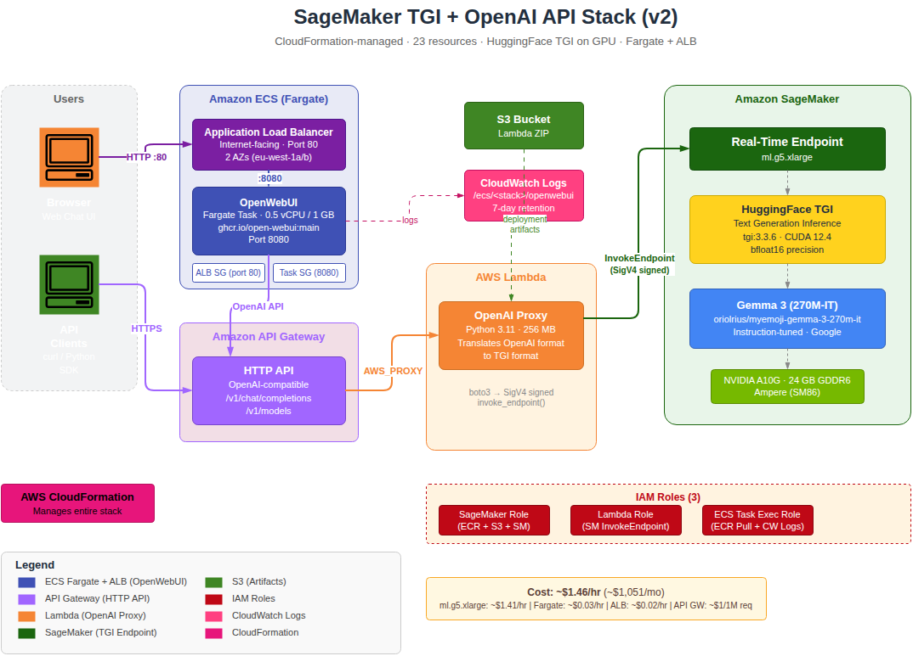

# SageMaker TGI + OpenAI API + OpenWebUI

Deploy a HuggingFace model on AWS SageMaker with HuggingFace TGI (Text Generation Inference), exposed via an OpenAI-compatible API, with OpenWebUI for a chat interface.

## Architecture



```
+-------------+     +--------------+     +----------+     +-----------------+
| OpenWebUI   |---->| API Gateway  |---->|  Lambda  |---->| SageMaker TGI   |
| (Fargate)   |     | (HTTP API)   |     |  (proxy) |     |   Endpoint      |
+------+------+     +--------------+     +----------+     +-----------------+
       |                    ^
  ALB (port 80)             |
       |                    |
       +-- Browser ---------+-- API Clients (curl, Python, etc.)
```

### Components

| Component | Description |
|-----------|-------------|
| **SageMaker Endpoint** | Runs HuggingFace TGI with your model on GPU (ml.g5.xlarge, NVIDIA A10G) |
| **Lambda** | Proxies OpenAI-format requests to SageMaker TGI format (handles SigV4 signing) |
| **API Gateway** | Public HTTP API (OpenAI-compatible: `/v1/chat/completions`, `/v1/models`) |
| **ECS Fargate + ALB** | Web-based chat interface (OpenWebUI) running as a managed container |

### Default Model

The default model is **[oriolrius/myemoji-gemma-3-270m-it](https://huggingface.co/oriolrius/myemoji-gemma-3-270m-it)** -- a Gemma 3 270M instruction-tuned model. Being instruction-tuned, it responds naturally to chat-style prompts.

## Quick Start

### Prerequisites

- AWS CLI configured with credentials
- VPC with **two public subnets in different AZs** (required for ALB)
- GPU quota for ml.g5.xlarge (check Service Quotas)
- [uv](https://github.com/astral-sh/uv) (Python package manager) for Lambda packaging

### Deploy

```bash
cd infra/

# Find your VPC and subnets
aws ec2 describe-vpcs --region eu-west-1 \
  --query 'Vpcs[*].[VpcId,Tags[?Key==`Name`].Value|[0]]' --output table

aws ec2 describe-subnets --region eu-west-1 \
  --filters Name=vpc-id,Values=<vpc-id> \
  --query 'Subnets[?MapPublicIpOnLaunch==`true`].[SubnetId,AvailabilityZone]' --output table

# Deploy full stack (requires 2 subnets in different AZs)
./deploy-full-stack.sh \
  --vpc-id vpc-xxx \
  --subnet-id subnet-aaa \
  --subnet-id-2 subnet-bbb
```

Deployment takes ~15-20 minutes (mostly SageMaker endpoint startup).

### Access

After deployment:
- **OpenWebUI**: `http://<alb-dns-name>` (shown in output)
- **API**: `https://<api-id>.execute-api.eu-west-1.amazonaws.com`

### Test API

```bash
# List models
curl https://<api-endpoint>/v1/models

# Chat completion
curl -X POST https://<api-endpoint>/v1/chat/completions \
  -H "Content-Type: application/json" \
  -d '{"messages": [{"role": "user", "content": "Hello, how are you?"}], "max_tokens": 50}'
```

### Cleanup

```bash
cd infra/
./delete-full-stack.sh
```

## Configuration

| Parameter | Default | Description |
|-----------|---------|-------------|
| `--model-id` | oriolrius/myemoji-gemma-3-270m-it | HuggingFace model ID |
| `--sagemaker-instance` | ml.g5.xlarge | GPU instance type (must support bfloat16) |
| `--subnet-id` | (required) | First public subnet |
| `--subnet-id-2` | (required) | Second public subnet (different AZ, for ALB) |
| `--stack-name` | openai-sagemaker-stack | CloudFormation stack name |
| `--external-sagemaker-role-arn` | - | Use existing SageMaker role (for Domain integration) |

### Example: Deploy a different model

```bash
./deploy-full-stack.sh \
  --vpc-id vpc-xxx \
  --subnet-id subnet-aaa \
  --subnet-id-2 subnet-bbb \
  --model-id google/gemma-3-1b-it \
  --sagemaker-instance ml.g5.xlarge
```

## Cost

| Resource | Type | Cost |
|----------|------|------|
| SageMaker | ml.g5.xlarge | ~$1.41/hour |
| Fargate | 0.5 vCPU / 1 GB | ~$0.03/hour |
| ALB | Application LB | ~$0.02/hour |
| API Gateway | HTTP API | ~$1/million requests |

**Total**: ~$1.46/hour (~$1,051/month if 24/7)

**Remember to delete resources when not in use!**

## Inference Runtime

| Aspect | Value |
|--------|-------|
| Container | `huggingface-pytorch-tgi-inference:2.7.0-tgi3.3.6` |
| Precision | bfloat16 (required for Gemma 3) |
| GPU | NVIDIA A10G (24 GB GDDR6, Ampere) |
| Max input tokens | 1024 |
| Max total tokens | 2048 |

### Why TGI?

Gemma 3 requires bfloat16 precision and has a specific architecture that TGI supports natively. The HuggingFace TGI container on SageMaker provides native bfloat16 support on A10G GPUs, built-in chat template handling, and optimized memory management.

## Security

This setup is for **development/testing**:
- No API authentication
- OpenWebUI auth disabled

For production, add API Gateway authentication and enable OpenWebUI auth.

## Project Structure

```
.
+-- infra/                      # CloudFormation IaC + deploy/delete scripts
+-- lambda/openai-proxy/        # Lambda function (OpenAI -> SageMaker proxy)
+-- scripts/                    # Standalone CLI tools (test, deploy, cleanup)
+-- openwebui/                  # Local dev config (Fargate uses inline config)
+-- .github/workflows/          # CI/CD (deploy + destroy)
+-- docs/                       # Architecture diagram + SageMaker quotas
+-- cookbook.md                  # Step-by-step deployment guide
```

## Development

### Lambda Function

```bash
cd lambda/openai-proxy
uv sync --dev
uv run pytest -v
uv run ruff check src/ tests/
```

### Scripts (SageMaker Tools)

```bash
cd scripts/
uv sync
uv run test-endpoint <endpoint-name>
```

### OpenWebUI (Local)

```bash
cd openwebui/
cp .env.example .env
# Edit .env and set OPENAI_API_BASE_URL
docker-compose up -d
```

## License

MIT
